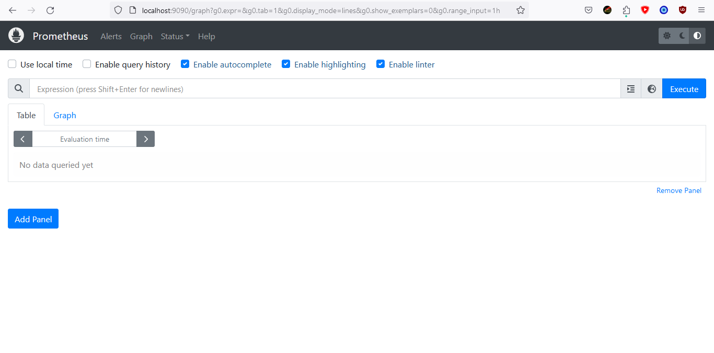
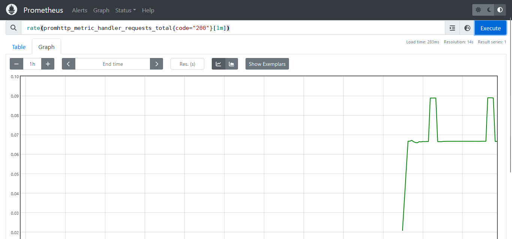
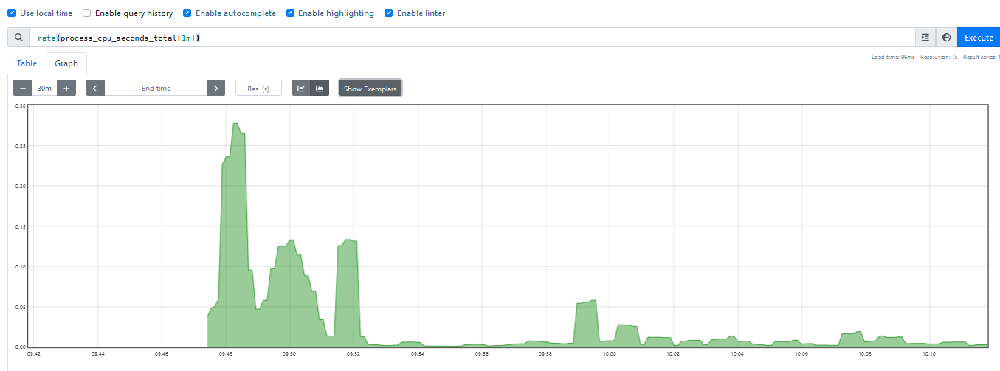
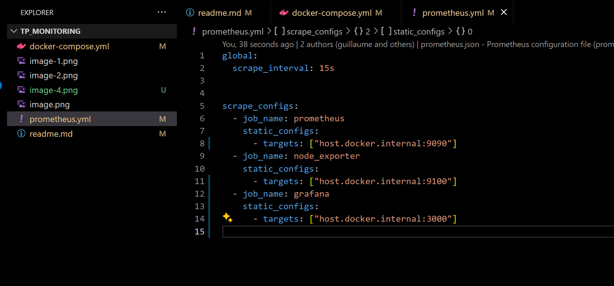
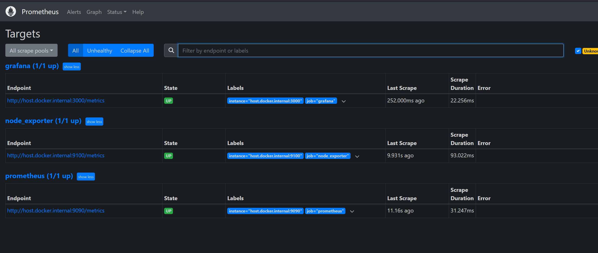
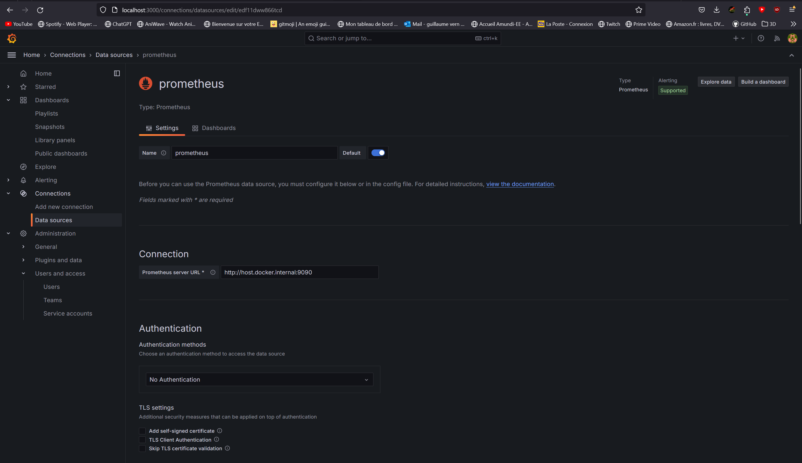
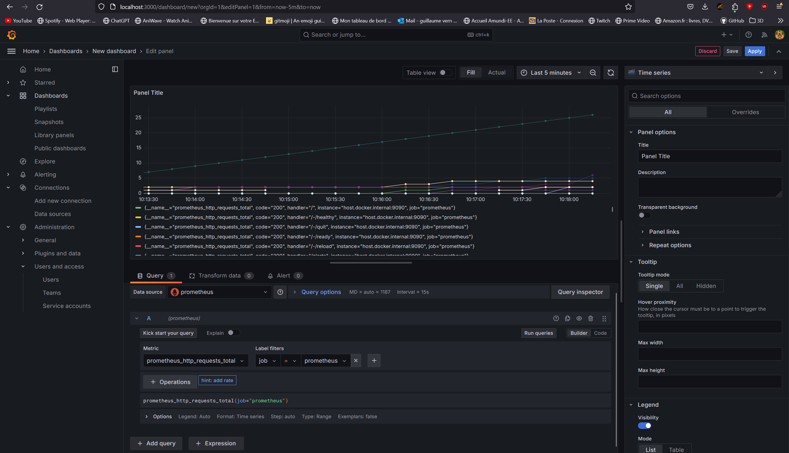
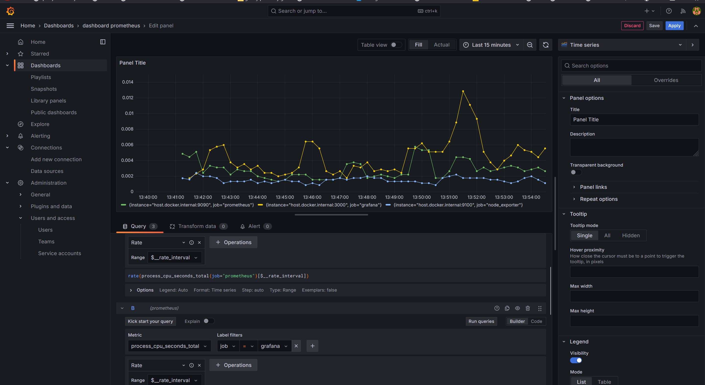
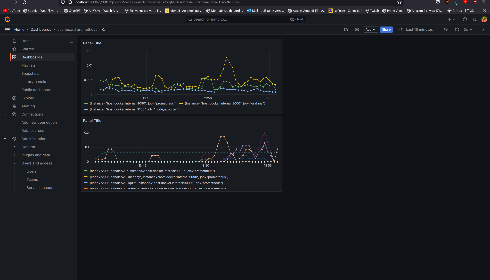

## Objectifs :  
- Configurer un/des outil(s) de monitoring sur une application.
- Surveiller le fonctionnement de votre système (métriques système) et/ou de votre application (logs applicatif).
- Positionner des alertes lorsque certains seuils (CPU, RAM, Disk) sont franchis 
- Choix des technos : Grafana, Loki, Prometheus.

### Création d'un conteneur avec prometheus pour explorer l'application

docker run --name prometheus -d -p 127.0.0.1:9090:9090 prom/prometheus

  

test d'une expression pour l'interface de graphiques (l'application se monitore elle-même pour le moment)

 

second test avec l'utilisation du cpu

ajout d'autres service a monitorer

datasource prometheus dans grafana

prometheus job dans grafana

connexion a prometheus dans grafana

ajout du monitoring d'utilisation cpu dans le dashboard

dashboard dans grafana

